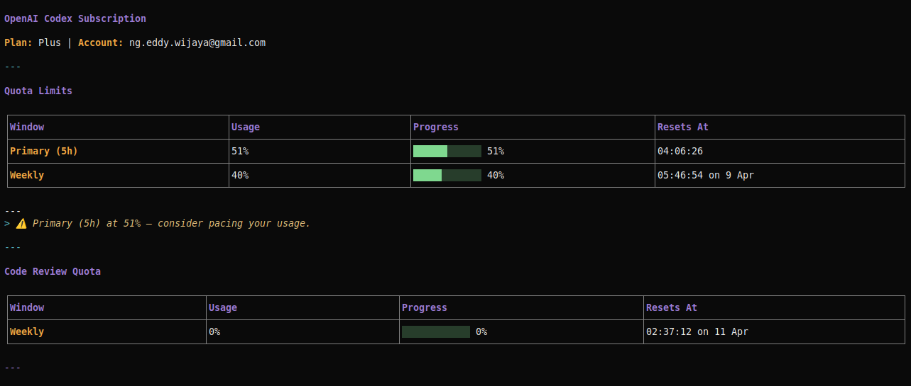

# opencode-codex-quota

[](https://www.npmjs.com/package/opencode-codex-quota)
[](LICENSE)
[](https://github.com/guyinwonder168/opencode-codex-quota/issues)
[](https://nodejs.org)
[](https://sonarcloud.io/summary/new_code?id=guyinwonder168_opencode-codex-quota)
---
[](https://sonarcloud.io/summary/new_code?id=guyinwonder168_opencode-codex-quota)
[](https://sonarcloud.io/summary/new_code?id=guyinwonder168_opencode-codex-quota)
[](https://sonarcloud.io/summary/new_code?id=guyinwonder168_opencode-codex-quota)
[](https://sonarcloud.io/summary/new_code?id=guyinwonder168_opencode-codex-quota)

OpenCode plugin that displays your **ChatGPT Plus/Pro Codex subscription quota** directly in the terminal — no browser needed.

## Features

- **Single `/codex_quota` command** — a convenient wrapper that asks OpenCode to call the quota tool
- **Rich Markdown output** — themed headers, progress bars, tables rendered by OpenCode TUI
- **5h + Weekly windows** — primary 5-hour and secondary weekly usage with local reset clocks
- **Code review quota** — shown when applicable to your plan
- **Credits & spend control** — balance, approximate message counts, spending status
- **Advisory + warning banners** — pacing notes at 50%+, stronger warnings at 80%+, critical at 100%
- **Two display modes** — full for `/codex_quota`, compact for agent/tool usage or `/codex_quota compact`
- **Auth from OpenCode** — reads your existing `opencode auth login` credentials, no extra setup

## Screenshot



Example full-mode output rendered in the OpenCode TUI.

## Install

### Via config file (recommended)

Add to your OpenCode config (`~/.config/opencode/config.json` or project `opencode.json`):

```json
{
  "plugin": ["opencode-codex-quota"]
}
```

### From source (development)

```bash
git clone https://github.com/guyinwonder168/opencode-codex-quota.git
cd opencode-codex-quota
npm install
npm run build
```

Then point OpenCode at your local package directory:

```json
{
  "plugin": ["./path/to/opencode-codex-quota"]
}
```

This project is packaged as an npm/path plugin. OpenCode also supports raw local plugin files placed directly in `.opencode/plugins/` or `~/.config/opencode/plugins/`, but that is a different layout from this repository.

## How `/codex_quota` works

In current OpenCode plugin APIs:

- the `codex_quota` **tool** is exposed to the agent/tool loop
- the `/codex_quota` **slash command** is a wrapper prompt that tells OpenCode to call that tool

That means `/codex_quota` is convenient and reliable, but it is still **LLM-mediated**, not a direct no-LLM syscall.

## Usage

### Wrapper Command (Full Mode)

```
/codex_quota
```

Shows complete quota details: plan type, primary 5h window, weekly window,
code review quota, credits, spend control, and promotional info.

Under the hood, the wrapper prompt asks OpenCode to call the `codex_quota` tool and present the result.

You can also pass `compact` to the slash command when you want the shorter table:

```
/codex_quota compact
```

**Example output:**

```markdown
# OpenAI Codex Subscription

**Plan:** Plus | **Account:** user@example.com

---

## Quota Limits

| Window | Usage | Progress | Resets At |
|--------|-------|----------|------------|
| **Primary (5h)** | 51% | `██████░░░░░░` 51% | 04:06:26 |
| **Weekly** | 40% | `█████░░░░░░░` 40% | 05:46:54 on 9 Apr |

---

> ⚠️ Primary (5h) at 51% — consider pacing your usage.

---

## Code Review Quota

| Window | Usage | Progress | Resets At |
|--------|-------|----------|------------|
| **Weekly** | 0% | `░░░░░░░░░░░░` 0% | 02:37:12 on 11 Apr |

---

## Spend Control

**Status:** ✅ Within limit

---

*Updated: 2026-03-29T12:00:00.000Z*
```

### Agent / Tool Call (Compact Mode)

The underlying tool supports `mode=compact` for concise output when called by an AI agent:

```
codex_quota(mode="compact")
```

**Example output:**

```markdown
### Codex Quota — Plus

| Window | Usage | Progress | Resets At |
|--------|-------|----------|------------|
| 5h | 51% | `██████░░░░░░` | 04:06:26 |
| Weekly | 40% | `█████░░░░░░░` | 05:46:54 on 9 Apr |

**Status**: ✅ Within limits
```

### Conditional Sections

Some sections appear only when relevant:

| Section | When Shown |
|---------|-----------|
| **Code Review Quota** | When your plan includes code review limits |
| **Credits** | When you have credits or unlimited balance |
| **Promotional** | When promotional quota is active |
| **Warning banners** | When any window is 80–99% or 100% |
| **Advisory notes** | When any window is 50–79% |

## Requirements

- [OpenCode](https://opencode.ai) installed and configured
- **ChatGPT Plus or Pro** subscription with Codex access
- OAuth credentials via `opencode auth login` (select ChatGPT Plus/Pro)

## Error Handling

The plugin shows user-friendly Markdown messages for common issues:

| Error | Message |
|-------|---------|
| Missing auth | Setup instructions with `opencode auth login` steps |
| Wrong auth type | OAuth setup instructions |
| Empty token | Re-auth instruction |
| Token expired | Re-auth instruction |
| Network error | Connection check guidance |
| API 401/403 | Token refresh instruction |
| API 429 | Rate limited — wait a few seconds |
| API 5xx | Service unavailable — try later |
| Unexpected response | Partial data with update notice |

## Architecture

```
opencode-codex-quota/
├── src/
│   ├── index.ts              # Plugin entry point, tool definition
│   ├── types.ts              # All TypeScript interfaces
│   ├── services/
│   │   ├── auth-reader.ts    # Read auth.json → parse JWT → extract credentials
│   │   └── api-client.ts     # Call wham/usage → typed QuotaResponse
│   └── formatter/
│       ├── markdown.ts       # QuotaResponse → Markdown string
│       └── errors.ts         # Error codes → Markdown error messages
└── tests/
    ├── auth-reader.test.ts
    ├── api-client.test.ts
    ├── markdown.test.ts
    ├── errors.test.ts
    ├── index.test.ts
    └── integration.test.ts
```

**Data flow:**

```
/codex_quota
  → wrapper prompt tells OpenCode to call tool.codex_quota
  → AuthReader: auth.json → JWT → { token, accountId, email }
  → ApiClient: GET wham/usage → QuotaResponse
  → Formatter: QuotaResponse + mode → Markdown string
  → OpenCode TUI renders via Glamour
```

## Development

### Prerequisites

- [Node.js](https://nodejs.org) >= 18
- TypeScript >= 5.7

### Setup

```bash
git clone https://github.com/guyinwonder168/opencode-codex-quota.git
cd opencode-codex-quota
npm install
```

### Commands

```bash
npm run build         # TypeScript → dist/
npm run typecheck     # Type checking only
npm test              # Run all tests
npm run test:coverage # Run tests with coverage
npm run lint          # Check code style
npm run lint:fix      # Fix code style issues
```

### Testing

Tests use `vitest` with the Arrange-Act-Assert pattern. Mocks for `fetch` and `fs` are set up per test.

```bash
npm test                                   # All tests
npm test -- tests/auth-reader.test.ts      # Specific file
npm run test:coverage                      # With coverage report
```

## Contributing

Contributions are welcome! See [CONTRIBUTING.md](CONTRIBUTING.md) for guidelines.

## License

[MIT](LICENSE) © 2026 guyinwonder168

## Acknowledgments

- [slkiser/opencode-quota](https://github.com/slkiser/opencode-quota) — source of the API endpoint and auth flow discovery
- [OpenCode](https://opencode.ai) — the AI coding assistant this plugin extends
